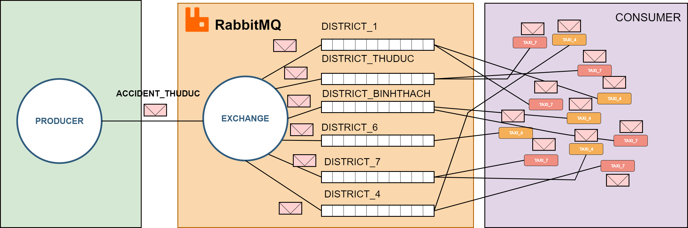

#### In this case, we have a problem of how the taxi knows the route they are traveling? If they are stuck in traffic or in an accident, we add this event to the queue that can send a message to the driver.

To present the **fanout** feature of exchanges, they will treat the case as if there was an accident in a certain place in the city. Then the producer will send a message to the exchanges, and the exchanges will send a message to the taxis to identify where there is an accident.

Block diagram for accident

