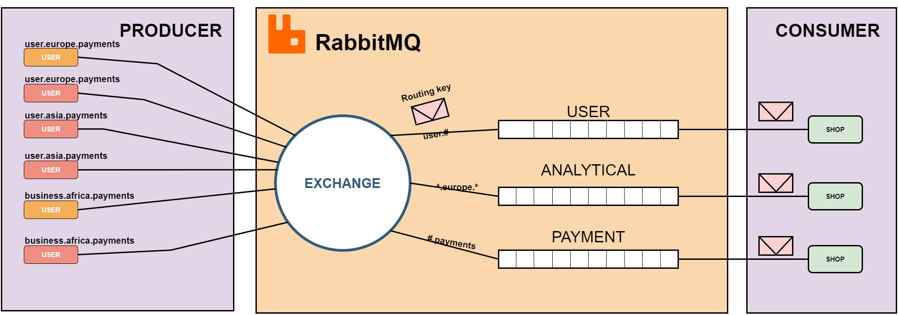

####In this problem, we explain the features of the queue. 
We have 2 cases below:

1. When a large volume of messages reaches the queue, those messages must wait until they are sent to the shop.

2. Few customers send messages to the queue, which makes queue always be empty.

The diagram below will clearly show the feature of the queue. To show, we have examples of many users in many places sending messages to exchanges with many different types of messages. Exchanges will divide different types of messages into predefined queues.

Block diagram for explain queueing
